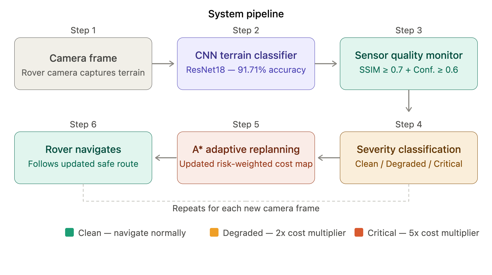
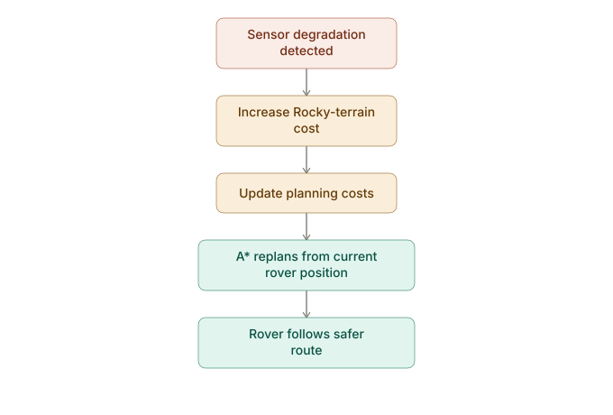

# Adaptive Path Replanning for Autonomous Mars Rover Navigation Under Sensor Degradation

A research project investigating **adaptive path replanning for autonomous Mars rover navigation when sensor quality deteriorates**.

The project combines terrain classification, sensor-quality monitoring, path planning, adaptive replanning, and a Unity-based rover simulation to investigate how an autonomous rover can respond when its perception of the environment becomes increasingly unreliable.

---

## Overview

Autonomous planetary rovers must navigate challenging terrain while relying on sensors to perceive their surroundings. Sensor degradation can result in inaccurate terrain information, potentially causing a rover to follow a path that becomes unsafe or costly to traverse.

This project investigates whether **Adaptive A*** can improve rover navigation under simulated sensor degradation by dynamically responding to changes in perceived terrain costs.

The system consists of three interconnected components:

1. **Google Colab / Python notebooks** — terrain classification, sensor degradation, monitoring, path planning, adaptive replanning, and evaluation.
2. **Live Server application** — provides the Python-based rover server and supporting terrain/navigation components.
3. **Unity simulation** — provides the visual rover environment and connects the simulated rover to the navigation system.

---

## Research Objectives

The project aims to:

* Develop a baseline A* path planner for rover navigation.
* Model different levels of sensor degradation.
* Classify Martian terrain according to its traversal risk.
* Monitor sensor quality during navigation.
* Implement Adaptive A* for dynamic path replanning.
* Compare baseline A* and Adaptive A* under increasing degradation.
* Evaluate whether adaptive replanning reduces traversal through high-cost terrain.
* Visualise rover navigation and terrain within a Unity environment.

---

## System Architecture

The project follows a pipeline from terrain perception to navigation and replanning:



---

## Terrain Risk Model

The terrain classes are grouped according to their expected traversability within the simulation.

| Terrain Category | Terrain Classes                             | Base Cost |
| ---------------- | ------------------------------------------- | --------: |
| Safe             | Other                                       |         1 |
| Rocky            | Bright Dune, Dark Dune, Slope Streak        |         5 |
| Hazardous        | Crater, Impact Ejecta, Spider, Swiss Cheese |         ∞ |

The costs represent **relative traversal costs within the simulation**, rather than measured physical risk values.

* **Safe terrain** is treated as the default traversable surface.
* **Rocky terrain** remains traversable but has a higher traversal cost.
* **Hazardous terrain** is treated as non-traversable by assigning an infinite cost.

---

## Sensor Degradation

Sensor degradation is simulated by increasing the perceived cost associated with affected terrain.

Three degradation levels are evaluated:

* **Mild**
* **Moderate**
* **Severe**

The purpose is to investigate whether the navigation system can respond to increasingly unreliable environmental information and select a safer alternative route.

---

## Path Planning

### Baseline A*

A* is used as the baseline path-planning algorithm. It searches for a minimum-cost path between the rover's starting position and its target while considering the traversal cost of each terrain cell.

### Adaptive A*

Adaptive A* extends the planning process by allowing information from previous searches to be reused during replanning.

When terrain costs change because of simulated sensor degradation, the rover can reconsider its existing route rather than simply continuing along the original path.



The comparison between baseline A* and Adaptive A* forms the main experimental component of the project.

---

## Experimental Results

The experiments showed that the baseline planner became increasingly affected as degradation severity increased, while Adaptive A* consistently identified a lower-cost alternative route in the tested scenarios.

| Degradation | Baseline A* | Adaptive A* |
| ----------- | ----------: | ----------: |
| Mild        |       ~9.42 |       ~7.67 |
| Moderate    |      ~14.33 |       ~7.67 |
| Severe      |      ~17.33 |       ~7.67 |

The results indicate that Adaptive A* was able to avoid increasingly costly terrain in the experimental environment.

The approximately **7.67** adaptive cost remained consistent across the three degradation scenarios because the planner selected an alternative route whose cost was largely unaffected by further increases in the degraded region.

These results are specific to the terrain and degradation scenarios used in the experiment and should not be interpreted as universal performance guarantees.

---

## Repository Structure

```text
martian-rover-adaptive-replanning/
│
├── notebooks/
│   ├── 01_martian_rover_baseline.ipynb
│   ├── 02_sensor_degradation.ipynb
│   ├── 03_cnn_classifier.ipynb
│   ├── 04_sensor_quality_monitor.ipynb
│   ├── 05_adaptive_replanning.ipynb
│   ├── 06_evaluation.ipynb
│   ├── 07_terrain_aware_navigation.ipynb
│   ├── figures/
│   ├── terrain/
│   ├── monitor_config.json
│   ├── nb05_results.csv
│   ├── nb06_evaluation_results.csv
│   ├── path_data.json
│   └── terrain_classifier.pth
│
├── live-server/
│   ├── rover_server.py
│   ├── monitor_config.json
│   └── terrain/
│
├── unity/
│   ├── Assets/
│   ├── Packages/
│   └── ProjectSettings/
│
├── .gitignore
├── LICENSE
└── README.md
```

> **Note:** The large `mars_terrain` dataset is not included in the repository. The notebooks download the required terrain data externally.

---

## Notebook Pipeline

The notebooks are organised according to the development and evaluation process:

| Notebook                            | Purpose                                   |
| ----------------------------------- | ----------------------------------------- |
| `01_martian_rover_baseline.ipynb`   | Baseline rover navigation and A*          |
| `02_sensor_degradation.ipynb`       | Simulation of sensor degradation          |
| `03_cnn_classifier.ipynb`           | Terrain classification using a CNN        |
| `04_sensor_quality_monitor.ipynb`   | Monitoring sensor/image quality           |
| `05_adaptive_replanning.ipynb`      | Adaptive A* path replanning               |
| `06_evaluation.ipynb`               | Performance evaluation and comparison     |
| `07_terrain_aware_navigation.ipynb` | Navigation using real terrain information |

---

## Unity Simulation

The Unity component provides a visual simulation environment for the rover.

It contains:

* Perseverance rover model
* Rover controller
* Camera-follow system
* Navigation camera feed
* Terrain mesh
* Terrain materials
* Rover network client
* Navigation scene
* Path data integration

The Unity project follows the standard Unity repository structure:

```text
Assets/
Packages/
ProjectSettings/
```

Generated Unity folders and local editor settings are excluded through `.gitignore`.

---

## Live Server

The Live Server component provides the Python-based communication and navigation environment used to connect the navigation pipeline with the simulation.

The main server component is:

```text
rover_server.py
```

The local Python virtual environment is intentionally excluded from version control. Dependencies should be recreated in a new environment when setting up the project on another machine.

---

## Data

The project uses Martian terrain imagery organised into terrain classes such as:

```text
bright dune/
crater/
dark dune/
impact ejecta/
other/
slope streak/
spider/
swiss cheese/
```

The dataset itself is **not stored in this repository** to avoid committing large amounts of downloaded data.

The notebooks contain the necessary logic to retrieve the required data from the external source.

---

## Requirements

The Python components require a Python environment with the relevant machine-learning and scientific-computing libraries.

Typical dependencies include:

* Python
* NumPy
* Pandas
* Matplotlib
* OpenCV
* PyTorch
* scikit-learn
* scikit-image
* Jupyter / Google Colab

The Unity component requires a compatible version of **Unity 6** with the packages specified in `Packages/manifest.json`.

---

## Running the Project

### Google Colab

The notebooks can be opened in Google Colab and executed in sequence.

Recommended order:

```text
01 → 02 → 03 → 04 → 05 → 06 → 07
```

The required terrain data is downloaded externally by the notebooks.

### Live Server

Create a Python virtual environment and install the required dependencies before running:

```bash
python rover_server.py
```

The local `rover_env` directory used during development is not included in the repository.

### Unity

Open the `unity/` directory as a Unity project.

Unity will regenerate its local `Library`, `Temp`, and other generated directories automatically.

---

## Technologies


## Methods

**Path Planning:** A* · Adaptive A*

**Computer Vision:** CNN-based terrain classification · SSIM

**Navigation:** Terrain-aware cost mapping · Sensor degradation · Adaptive replanning

---

## Limitations

The current system is a simulation-based research implementation and therefore includes several simplifying assumptions.

* Terrain risk values are relative simulation costs rather than experimentally measured rover mobility values.
* Hazardous terrain is modelled as completely non-traversable.
* Sensor degradation is simulated rather than obtained from physical rover sensors.
* The experiments are performed on a controlled terrain environment.
* The results therefore demonstrate the behaviour of the proposed approach within the defined experimental conditions rather than guaranteeing performance on a real Mars rover.

---

## Future Work

Potential extensions include:

* Testing on larger and more diverse terrain environments.
* Incorporating more realistic rover mobility constraints.
* Modelling continuous rather than discrete sensor degradation.
* Comparing Adaptive A* directly with D* and D* Lite.
* Incorporating uncertainty-aware terrain costs.
* Testing the navigation system with real sensor data.
* Deploying the approach on physical rover hardware.
* Investigating learning-based adaptive navigation methods.

---

## Research Context

This project was developed as part of a dissertation investigating:

**Adaptive Path Replanning for Autonomous Mars Rover Navigation Under Sensor Degradation**

The work combines autonomous navigation, computer vision, terrain classification, sensor-quality assessment, and adaptive path planning within a simulated planetary exploration environment.

---

## License

This project is released under the terms specified in the repository's `LICENSE` file.
